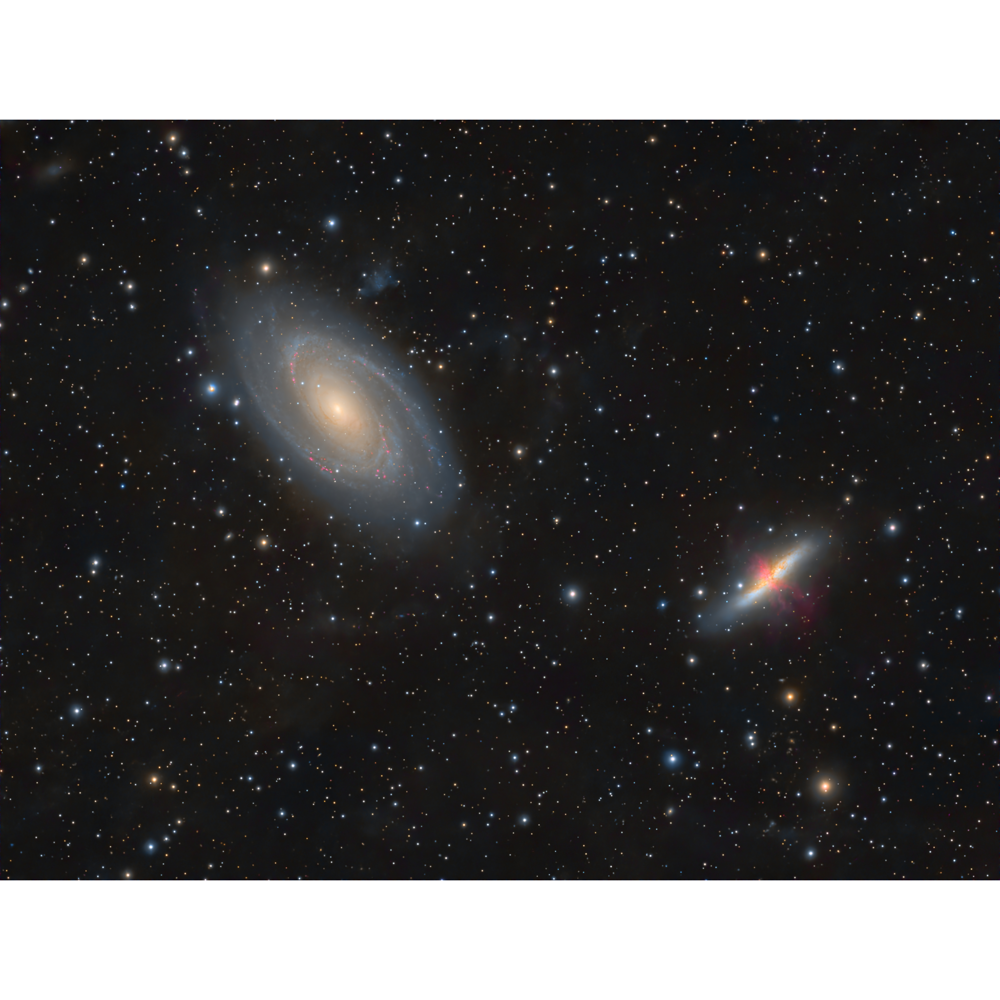
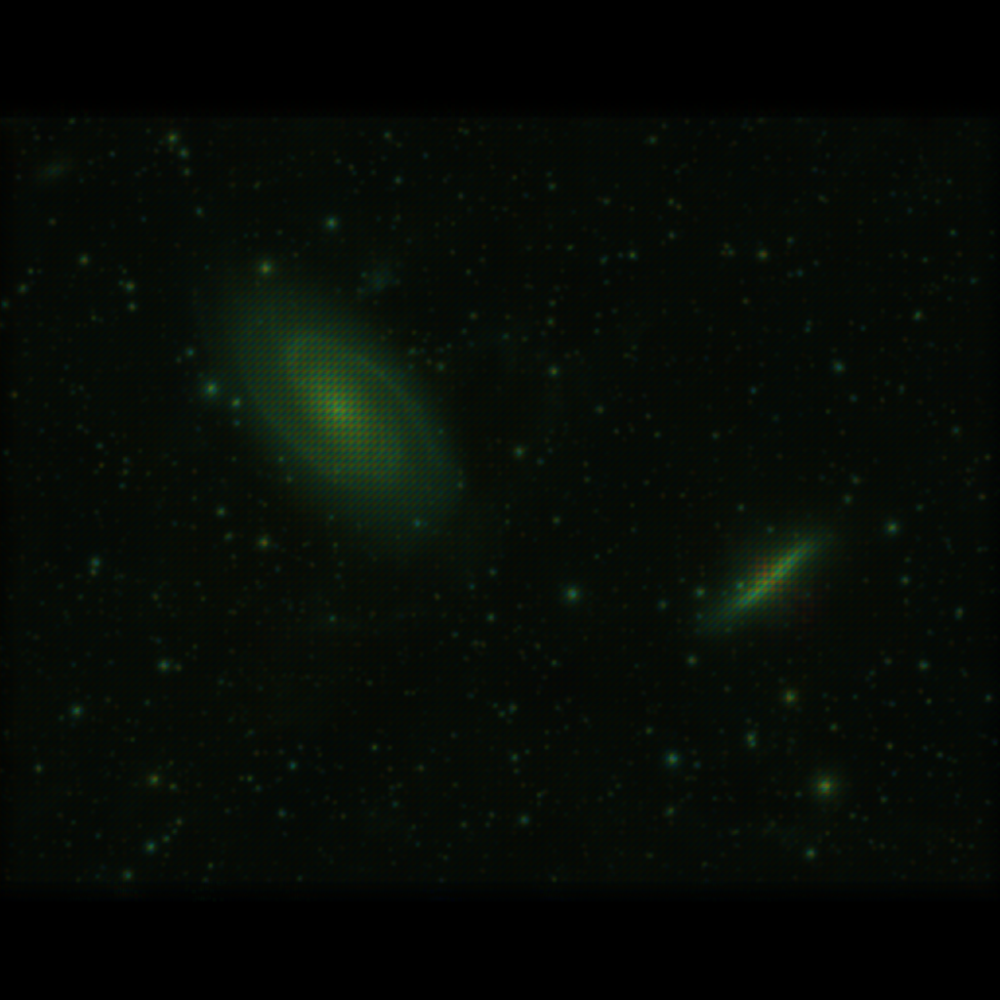

# Image Stack Reconstruction Simulator

This project aims to be a playground for simulating stacked undersampled image reconstruction. In `index.ts` a camera is simulated to take "pictures" of an input image. In reconstruct.ts, a primitive image stacker is used as a baseline. In reconstruct_improved.ts, a subpixel-level normalization step is added.

## Fixed Pixel Grid and Bayer Pattern Normalization

The immediate goal is to document a technique I thought of for improving image stacking, especially of CFA drizzle bayered images. This improvement involves a subpixel-level normalization process which replaces the typical end normalization step in stacking. At registration time, a copy of each input image is registered with only the fixed pixel grid pattern and not the relative values of the pixels, and these registered fixed grid patterns are then stacked as well, such that whenever an input pixel is used for the final stack it's corresponding registered pixel grid pattern is added. The resulting stack which I'm calling the "imaging grid time observed pattern map" or "bayer time observed pattern map" for CFA images can then be divided out of the final image, virtually eliminating fixed grid noise introduced by the shapes of input pixels themselves and/or bayer patterns as long as each output point is observed at least once for each color.

## Results

I used SSIMULACRA2 to confirm the benefits of this technique beyond visual comparison:

Original Image rescaled to output size:

Reconstruction from 32 simulated dithered camera images Without Subpixel Normalization

SSIMULACRA2 score -89.4 (better values increase towards 100)

Reconstruction from 32 simulated dithered camera images With Subpixel Normalization using the "imaging grid time observed pattern map"
SSIMULACRA2 score -61.2

