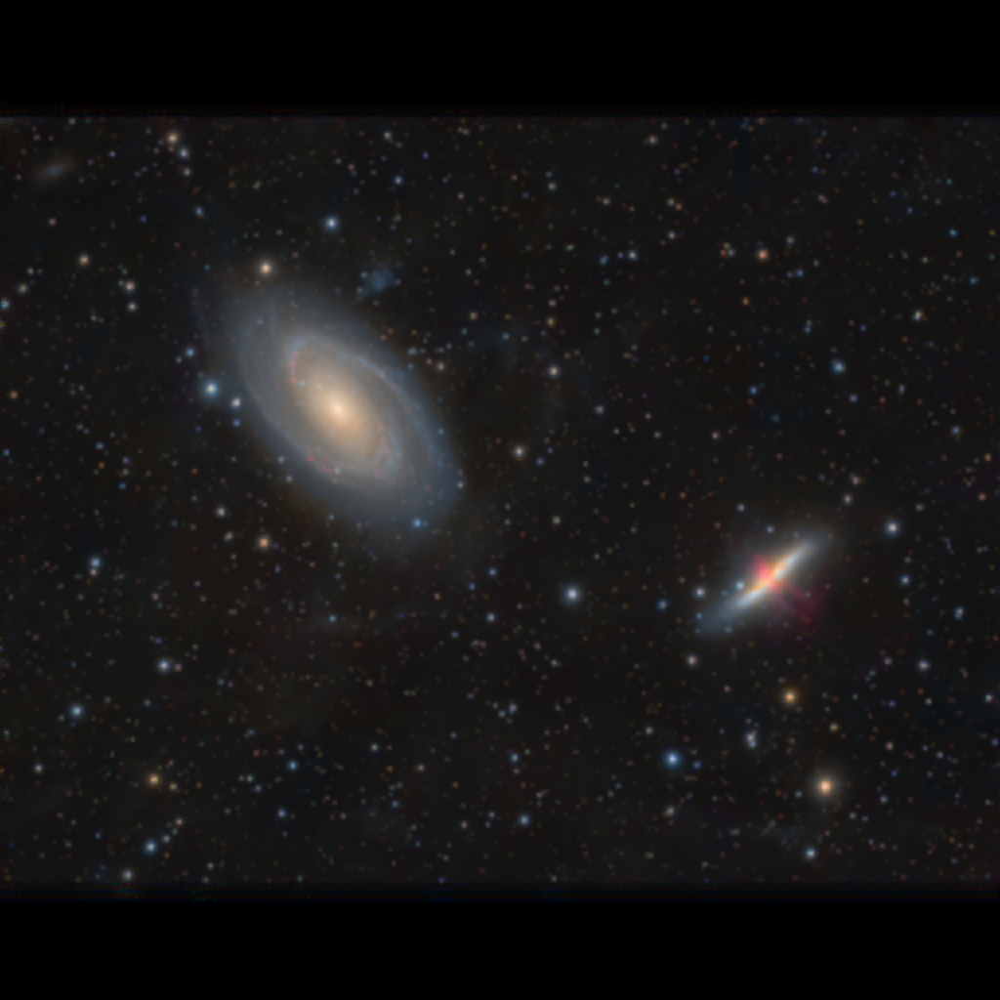

# Image Stack Reconstruction Simulator

This project aims to be a playground for simulating stacked undersampled image reconstruction. In `index.ts` a camera is simulated to take "pictures" of an input image. In reconstruct.ts, a primitive image stacker is used as a baseline. In reconstruct_improved.ts, a subpixel-level normalization step is added.

## Fixed Pixel Grid and Bayer Pattern Normalization

The immediate goal is to document a technique I thought of for improving image stacking, especially of CFA drizzle bayered images, but also applicable to mono when drizzling with a fractional pixel factor. This improvement involves a subpixel-level normalization process which replaces the typical end normalization step in stacking. At registration time, a copy of each input image is registered with only the fixed pixel grid pattern and not the relative values of the pixels, and these registered fixed grid patterns are then stacked as well, such that whenever an input pixel is used for the final stack it's corresponding registered pixel grid pattern is added. The resulting stack which I'm calling the "imaging grid time observed pattern map" or "bayer time observed pattern map" for CFA images can then be divided out of the final image, virtually eliminating fixed grid noise introduced by the shapes of input pixels themselves and/or bayer patterns as long as each output point is observed at least once for each color.

The technique is applicable to drizzle stacking of CFA data at any scale level and to drizzle stacking of mono data with pixel fraction less than image scale.

## Results

### Application to bayered images with no use of pixel fraction

I used SSIMULACRA2 to confirm the benefits of this technique beyond visual comparison:

Original Image rescaled to output size:

Reconstruction from 32 simulated bayered dithered camera images Without Subpixel Normalization

SSIMULACRA2 score -89.4 (better values increase towards 100)

Reconstruction from 32 simulated bayered dithered camera images With Subpixel Normalization using the "imaging grid time observed pattern map"

SSIMULACRA2 score -61.2

## Application to Mono when pixelFraction is used

Reconstruction from 32 simulated non-bayered dithered camera images, drizzled with dropshrink .5, Without Subpixel Normalization

SSIMULACRA2 score -101.106 (better values increase towards 100)

Reconstruction from 32 simulated non-bayered dithered camera images, drizzled with dropshrink .5, With Subpixel Normalization using the "imaging grid time observed pattern map"

SSIMULACRA2 score -95.53

## Usage

Requires node 23.

Install dependencies with `npm install`

run camera simulator with `node index.ts`

run stack simulator with `node reconstruct.ts`

run subpixel normalization stack simulator with `node reconstruct_improved.ts`

run mono camera simulator with `node sim_mono_camera.ts` - this pretends as if a single camera could do mono in all 3 channels at once.

run mono half pixel fraction drizzle stack simulator with `node reconstruct_unbayered.ts`

run mono half pixel fraction drizzle stack simulator including the subpixel normalization fix with `node reconstruct_unbayered.ts`

The input image needs a 2048x2048 version and a 1024x1024 version. The 2048x2048 version is set in index.ts line 115. The 1024x1024 version is used to calculate SSIMULACRA2 set in reconstruct.ts line 120 and reconstruct-improved.ts line 157.